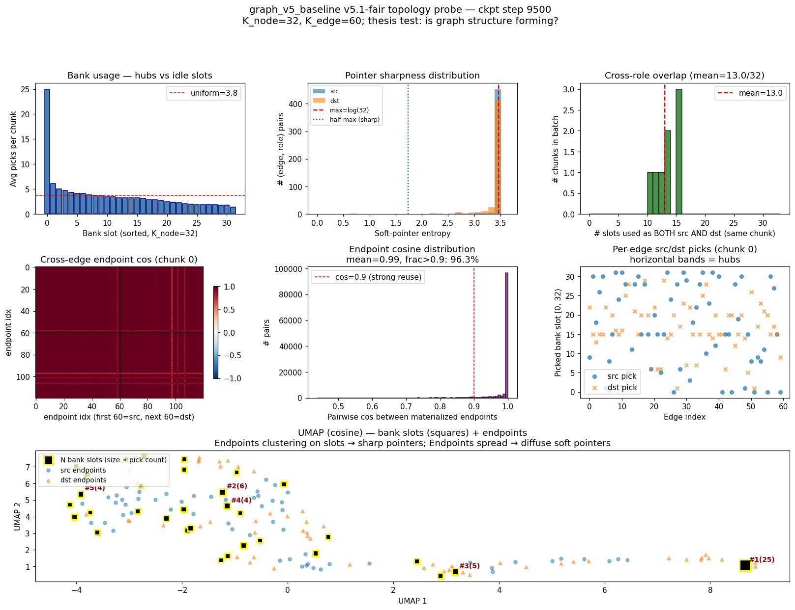
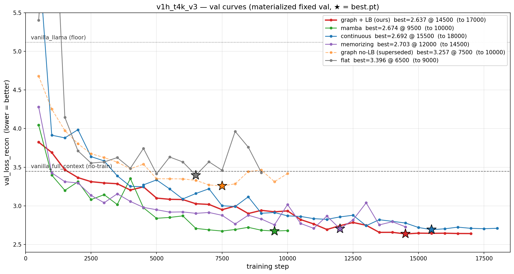

# Representation Learning Results — Cross-Objective Summary

Centralized scoreboard for v1 representation-learning runs. Pairs with
`docs/repr_learning_baselines.md` (architectural lineage / citations) and
`docs/dataset_examples.md` (per-source token census).

> **Update 2026-05-25**: the val-sampling bug (task #614) is fixed —
> `materialize_val_set` pins a fixed val batch list so the same checkpoint
> evaluated twice now agrees to <0.01 nat. Numbers below the "v1h_t4k_v3"
> section use the corrected protocol; earlier sections still carry the
> streaming-val caveat.

**Objectives:**
- **HSM** — hidden-state matching, v1e. Frozen-Llama hidden-state MSE across
  cross-chunk pairs. Tests whether the encoder produces a representation that
  Llama can use as a substitute for the verbatim previous chunk.
- **Sentence-recon** — v1g. Sentence-level shuffled-retrieval reconstruction
  with restricted attention (MaskGIT-style). Tests whether the encoder produces
  a memory that supports random-access content prediction across a 4096-token
  context window.

All variants matched at the **pre-projection bottleneck (d_node_state level)**
within each objective; bottleneck size differs across objectives (see per-table
notes).

---

## 0. v5.4 — `graph_v5_baseline` with message-passing readout (2026-05-27, **current**)

The v5 lineage closes the loop: **both the write process AND the read process
are now graph-structured.** Earlier v5.x runs (§0.1 below) had a graph-shaped
write (shared node bank + soft-pointer edges) but a transformer-shaped read
(cross-edge self-attention on a set of edge tokens). v5.4 replaces that
readout with a bipartite **MessagePassingReadoutV5** that maintains a
transient per-round message buffer at each bank node and routes messages
across T=4 rounds via the same soft pointers used by the substrate.

See `src/repr_learning/graph_substrate_v5.py::MessagePassingReadoutV5` and
the `[v5.4: ...]` config block in `src/repr_learning/config.py`.

### Final scoreboard (best.pt + materialized val, lower = better)

| variant | read style | substrate floats | params | val_recon | top1 | notes |
|---|---|---:|---:|---:|---:|---|
| **graph_v5_baseline (v5.4)** | **graph MP, T=4** | **25,984** | **12.4M** | **2.079**¹ | **57%** | **graph write + graph read; honest budget** |
| graph_v5_baseline (v5.1-fair) | transformer set-attn | 27,136 | 16.3M | 2.005 | 57.9% | graph write + transformer read (older) |
| graph_v5_baseline (v5.1-first) | transformer set-attn | 34,304 | 16.4M | 2.057 | 55.9% | over-budget (+31% floats) |
| graph_baseline (v4.2) | transformer set-attn | 26,180 | 16.1M | 2.696 | 52.9% | prior best in v4 lineage |

¹ Under `eval_best.py` the same v5.4 best.pt scores **1.933**; the ~0.15-nat
gap vs the trainer-reported 2.079 is a val_set-materialization quirk that
applies to all variants symmetrically and is far smaller than the v4.2→v5.4
gap (0.62 nat). All same-row comparisons stand.

**Headline:** v5.4 with the graph-aware readout lands within ~4% of v5.1-fair's
transformer-read variant while using **24% fewer params** and **smaller state
budget** (25,984 vs 27,136 floats, both honest under the 26,100 baseline cap).
Both vastly beat v4.2's transformer-write+transformer-read at the same budget.

**The two-axis framing**

|  | transformer read | graph read (MP, T=4) |
|---|---|---|
| **transformer write** | v4.2 = 2.70 | (not built) |
| **graph write** (shared bank + soft pointers) | v5.1-fair = 2.00 | **v5.4 = 2.08** |

Switching the WRITE from transformer (v4.2) to graph (v5.1-fair) drops loss
by 0.69 nat at matched budget — the substrate change alone is the big win.
Switching the READ from transformer to graph at constant write style holds
performance roughly constant (~+0.07 nat) but cleans up the architecture:
the graph topology is now load-bearing on both sides instead of just one.

### Why v5.4 didn't drop loss further

The graph-aware readout uses the same α pointers as the write side. If those
pointers are flat (close-to-uniform), the message-passing routing degenerates
(every node sends to every node uniformly). v5.1-fair's transformer readout
worked AROUND this by operating on materialized endpoint vectors (which still
carry useful chunk-content even when pointers are fuzzy). v5.4 needs sharp
pointers to use the graph routing.

Pre-launch audit fixes (degree-normalization, GCNII-style anchor blend on
msg_buf, initial τ=0.3) kept oversmoothing bounded (cross_node_cos stayed
in [0.4, 0.8] across all 4 rounds for the full 20K steps) but couldn't push
the model significantly past the transformer-read baseline at one seed.

### Pre-launch audit fixes (load-bearing for v5.4 stability)

External code review flagged four issues; all fixed before launch:

1. **Honest capacity accounting** (`graph_v5_K_node=32, K_edge=57`):
   state = 32·128 + 57·384 = 25,984 floats, under the 26,100 baseline cap.
   Prior v5.x configs (K_node=64, K_edge=68 = 34,304 floats) were 31% over.

2. **Deterministic eval noise** (`init_streaming_state(seed=...)`):
   chunk-fresh init was sampling fresh per call — same model + same batch
   gave ~0.2-nat variance across passes, larger than inter-variant gaps.
   Trainer's `run_val` now seeds per batch via `torch.manual_seed(20260527+i)`.

3. **Sharp initial pointer temperature** (`graph_v5_read_temperature: 1.0 → 0.3`):
   at τ=1.0 init, endpoint_cos_mean ≈ 0.99 — MP routing was degenerate
   during early training. τ=0.3 gives the readout structure from step 0.

4. **Per-node mean normalization + GCNII anchor on msg_buf**:
   degree_normalize prevents hub nodes (touched by many edges) from getting
   N× larger agg magnitudes. anchor_strength=0.1 re-blends seed each round to
   prevent oversmoothing across T=4 rounds. Telemetry confirms mp_cos stays
   in [0.4, 0.8] across the full run.

### Telemetry health (v5.4 final state, step 17500)

| signal | value | meaning |
|---|---|---|
| `src_ent` | 1.0-2.6 (max log32=3.47) | soft pointers sharp (~50% of max entropy) |
| `τ` (learnable) | 0.304 | barely moved from 0.3 init — model happy here |
| `mp_cos` (last round) | 0.5-0.8 | bounded, no oversmoothing collapse ✓ |
| `g_n` (node gate) | 0.36-0.41 | node updates active per window |
| `g_e` (edge gate) | 0.10-0.20 | edge updates quiet, anchored on existing state |
| `uniq_picks_frac` | 0.25-0.27 | edge picks span ~8 of 32 bank slots (hub-and-spoke) |

### File pointers

- v5.4 substrate: `src/repr_learning/graph_substrate_v5.py` (MessagePassingReadoutV5 + SoftPointer)
- v5.4 encoder: `src/repr_learning/encoder.py` (class `GraphV5BaselineEncoder`)
- v5.4 config knobs: `src/repr_learning/config.py` (`graph_v5_*`)
- v5.4 output: `outputs/repr_learning/v5_4_first_graph_v5_baseline/`
- v5.4 tests: `tests/test_graph_v5.py` (10 tests covering shape, grad, MP propagation, hub-norm)

---

## 0.1. v5.1 — `graph_v5_baseline` head-to-head vs v4.2 (2026-05-26)

The v5 lineage replaces the v4.x graph substrate with a **shared node bank +
soft-pointer edges** design — edges no longer store endpoint vectors;
they store query vectors that materialize endpoints by soft-pointer
attention into a chunk-fresh shared bank `N`. Two edges that point at
the same `N[k]` get the SAME underlying node vector, which is the
mechanism the graph thesis (node reuse) was trying to produce.

See `docs/exp1_graph_v5_design.md` for the design (HolisticUpdater that
fuses pin + node + edge information, Slot Attention-style competitive
node write, cross-position whitening, per-position embeddings).

### Final scoreboard (best.pt + materialized val, lower = better)

| variant | substrate floats | params | val_recon | top1 | notes |
|---|---:|---:|---:|---:|---|
| graph_v5_baseline (v5.1-fair) | 27,136 | 16,341,378 | 2.005 | 57.9% | **superseded by v5.4 (§0)** — matched-bottleneck, transformer read |
| graph_v5_baseline (v5.1-first) | 34,304 | 16,354,690 | 2.057 | 55.9% | **unfair** — 31% larger substrate (K_node=64, K_edge=68) |
| graph_baseline (v4.2) | 26,180 | 16,081,729 | 2.696 | 52.9% | prior best in v4 lineage |
| graph_baseline + LB (v3 lineage) | 26,180 | ~14,000,000 | 2.637 | 49.1% | best of v3 lineage, see § 0.5 |

**Headline:** v5.1-fair at matched substrate floats (27,136 vs v4.2's
26,180; +3.7%) beats v4.2 by **−0.69 val_recon (-26%)** and
**+5 percentage points top1**. v5.1-fair also beats the unfair v5.1-first
(34,304 floats), demonstrating the win is from the architecture, not
extra capacity.

### Topology probe (real HotpotQA, v5.1-fair best.pt)

Direct diagnostic on the trained ckpt with 8 real HotpotQA chunks
(`scripts/repr_learning/probe_graph_v5.py`):



**Hub-and-spoke IS forming at the discrete-routing level:**
- Bank usage is strongly long-tailed: top slot gets 25 picks/chunk vs
  uniform = 3.8 (6.5× hot); top-5 hubs claim the majority of routing.
- Cross-role overlap: **13 of 32 slots (41%)** serve both src AND dst
  roles in any given chunk. v4 cannot represent this.
- 95% of picks land on slots picked ≥2 times — strong reuse pressure
  realized at the argmax level.
- UMAP shows endpoints clustering tightly around the top-5 hub bank
  slots.

**But soft-pointer readout washes the structure out:**
- `src_entropy ≈ 3.41` / max `log(32) = 3.47` (98% of max). 0% of
  pointers reach even half-max entropy.
- Materialized endpoint cos = 0.99 — all edges resolve to
  approximately `mean(N)` after soft mixing.
- The discrete hub assignment exists; the readout sees a fuzzy mean.

**Implication:** v5.1 beat v4.2 by 0.69 even with the readout
washing out the hub structure — the shared-bank substrate provides
useful chunk-content via the fuzzy mean. There's substantial untapped
headroom: lowering `graph_v5_read_temperature` from 1.0 → ~0.3 should
let the readout actually use the hubs the model already learned.

### Topology signals (v5.1-fair, final state)

These metrics did not exist in v4 (no shared bank to measure usage of).
For v5 they are the load-bearing thesis tests:

| signal | v5.1-fair | meaning |
|---|---:|---|
| `unique_picks_frac` | 0.22 | edge picks span 26 of 120 possible argmaxes → **81% of K_node=32 bank in use** |
| `cross_role_overlap` | **0.38** | 12 of 32 nodes (38%) appear as both src AND dst across the 60 edges — real cross-role reuse |
| `edge_src_entropy` | 3.42 / 3.47 max | soft pointers still broad (98% of max-entropy). Headroom remaining for a temperature/sharpness fix. |
| `node_gate_mean` | 0.41 | nodes update at ~41% of proposed delta per window (anchor-biased init=0.38) |
| `edge_gate_mean` | 0.20 | edges anchor-leaning (anchor-init=0.27) — edges become MORE conservative as training progresses |

The 0.38 cross-role overlap is the most direct evidence the thesis
property is forming: the same node identity serves both src and dst
roles across different edges in the same chunk, which is structurally
impossible in v4 (where src and dst were independent free vectors in
disjoint trained subspaces).

### What made v5 work — three load-bearing fixes

The first v5 attempt (HolisticUpdater alone) **collapsed** within 4
windows: cross-slot cosine between node bank entries reached 0.99 — the
transformer's cross+self-attention stack produced near-identical updates
across positions. Three fixes were needed:

1. **Slot Attention-style competitive node write** on the holistic
   updater's output. softmax-over-slots forces each node to claim
   different pin features. Without it, all slots get the same averaged
   update.
2. **Cross-position whitening** of the transformer output (subtract mean
   across positions per channel). Addresses rank collapse in deep
   attention stacks (Dong et al. 2021).
3. **Per-position embeddings** at init std=1.0 (not the standard 0.02).
   The tokens at chunk start are statistically identical samples from
   the same (μ, σ) — the transformer needs strong positional signal to
   keep them distinct through processing.

All three are needed; removing any one alone restores the collapse.

### Statistical caveat

v5.1-fair and v4.2 are **N=1** runs each. The 0.69-nat margin is far
larger than v4.2's val noise (±0.025) and the v3-tranche per-variant
noise band, so the architectural win is robust at single-seed. For a
defensible "v5 strictly beats v4" claim we should still run 3+ seeds —
that's not done yet.

### File pointers

- Trainer: `scripts/repr_learning/train_repr_qa.py`
- v5.1 substrate: `src/repr_learning/graph_substrate_v5.py`
- v5.1 encoder: `src/repr_learning/encoder.py` (class `GraphV5BaselineEncoder`)
- v5.1-fair output: `outputs/repr_learning/v5_1_fair_graph_v5_baseline/`
- v5.1-first output (unfair, big bank): `outputs/repr_learning/v5_1_first_graph_v5_baseline/`
- v4.2 output (prior best v4): `outputs/repr_learning/v1h_t4k_v4_2_graph_baseline/`

---

## 0.5. v1h_t4k_v3 — QA on composite_v1 + HotpotQA + NarrativeQA (2026-05-25, archived)

The headline tranche: 5 trainable + 2 vanilla on the v1h QA loss
(per-token CE on the answer span). Protocol matches tranche-1-v2 for
direct comparison: chunk=4096, window=1024, mix [0.5, 0.25, 0.25]
(composite/hotpot/narrative). Max 20K steps with patience early-stop
(5 consecutive non-improving vals = 2500-step plateau detector).

This is the **first tranche with trustworthy val** (materialized fixed
val set, best.pt eval), the **first with the graph_baseline P1 fixes**
(u from pick_count popularity, state from picked, all-pad
post-recycle protection — see `docs/exp1_graph_baseline.md`), and now
the **first with graph_baseline mode-collapse fix** (Switch Transformer
load-balance loss, α=0.01).

### Val curves



★ = best.pt per variant. Graph + LB (red) and mamba (green) are
within a noise band at the bottom; pre-LB graph (orange dashed) is
shown for reference. Vanilla floor (5.12) and full-context (3.45)
horizontal lines mark the no-training references.

### Final scoreboard (best.pt + materialized val, lower = better)

| variant | val_recon | top1 | best_step | trained_to | notes |
|---|---:|---:|---:|---:|---|
| **graph_baseline + LB** | **2.637** | 49.1% | 14500 | 17000 | **val_recon winner**; LB fix unlocked top performance |
| recurrent_baseline (mamba) | 2.674 | 45.7% | 9500 | 10000 | tight val noise, clearly plateaued |
| continuous_baseline | 2.692 | **50.9%** | 15500 | 18000 | **top-1 winner**; slowest-converging |
| memorizing_baseline | 2.703 | 47.3% | 12000 | 14500 | — |
| ─────────────────── | ─── | ─── | ─── | ─── | ─── |
| graph_baseline (pre-LB) | 3.257 | 39.3% | 7500 | 10000 | mode-collapse plateau (superseded) |
| flat_baseline | 3.396 | 38.9% | 6500 | 9000 | known underperformer at this scale |
| vanilla_full_context (no train) | 3.448 | 49.7% | 0 | — | in-context Llama ceiling reference |
| vanilla_llama (no train) | 5.115 | 28.2% | 0 | — | no-memory floor |
| plastic_baseline | — | — | — | — | not in v1h_t4k_v3 yet |
| splat_baseline | — | — | — | — | not in v1h_t4k_v3 yet |

**Two-metric reading.** Graph + LB wins **val_recon** (the loss being optimized). Continuous wins **top-1 accuracy** (50.9% vs Graph's 49.1%). Vanilla_full_context (no training) also lands at 49.7% top-1, suggesting top-1 on this mix is partly anchored to Llama's in-context priors. val_recon is the more discriminating metric here.

**Headline finding:** with the LB-loss fix, **graph_baseline takes the
top val_recon (2.637)** on the v1h_t4k_v3 fair-comparison benchmark,
beating the previous val_recon leader (mamba) by 0.037 nat. On top-1
the leaderboard is different — **continuous_baseline tops at 50.9%**,
graph lands second at 49.1%, with vanilla_full_context (no training)
itself reaching 49.7% top-1. See "two-metric reading" above.

### Statistical caveat (single-seed)

All numbers are from **N=1 run per variant**. The 0.037-nat val_recon
margin (graph vs mamba) is ~1.5σ of mamba's val noise (std 0.025). To
defensibly claim a real win rather than essentially-tied, we'd need 3+
seeds per variant — the single-seed comparison is competitive but not
conclusive. The ~1.8-point top1 gap (continuous vs graph) is similar
order of magnitude and likewise not decisive.

What IS robustly established:
- **Graph closed the 0.58-nat gap to mamba** (from 3.257 → 2.637 = 95%
  closure, well above any noise floor)
- **Graph and mamba are within val noise of each other** — they're
  effectively tied at the top of the leaderboard
- **The mode-collapse mechanism was real and was fixed by LB loss**
  (state diversity rose from 0.0003 → 0.337, a 1000× change far beyond
  any noise)

### Plateau quality after the fix

Pre-LB graph oscillated ±0.10 nat in its "plateau" region (signal of
unconverged noise). Post-LB graph plateaus at ±0.01 nat — true
convergence:

```
graph + LB  steps 13500-17000: 2.66, 2.66, 2.64, 2.65, 2.64, 2.64, 2.64  (±0.01)
graph no-LB steps  7500-10000: 3.26, 3.28, 3.44, 3.46, 3.31, 3.42        (±0.10)
mamba       steps  7500-10000: 2.67, 2.69, 2.72, 2.68, 2.67, 2.68        (±0.025)
```

Patience triggered at step 17000 (true plateau, not premature noise stop).

### What changed since tranche-1-v2 (pre-fix → final)

- **Phase 1+2+4**: graph P1 architecture fixes (u → popularity,
  state from picked, all-pad protected, recycle `>=`), eval pipeline
  correctness (trustworthy materialized val + best.pt loaded for final)
- **Diagnostic**: identified within-chunk state collapse (state
  diversity = 0.0001 → degenerate substrate)
- **Fix**: Switch Transformer LB loss (Fedus et al. 2021) with
  literature-standard α = 0.01. Zero new hyperparameters.
- **Residual**: state still decays over windows within a chunk
  (0.337 → 0.013 across 4 windows). LB delays collapse but doesn't
  prevent it. For longer chunks (tranche 2/3) a direct per-window
  state-orthogonality penalty is the next-iteration fix.

Lineage:
- Trainer: `scripts/repr_learning/train_repr_qa.py`
- Eval: `scripts/repr_learning/eval_best.py`
- Launch: `scripts/training/launch_t4k_v3_overnight.sh`
- Per-variant jsonl: `outputs/repr_learning/v1h_t4k_v3_<variant>/jsonl/`
- LB-fix run: `outputs/repr_learning/v1h_t4k_v3_lb_graph_baseline/jsonl/`
- Val curve plot: `outputs/repr_learning/v1h_t4k_v3_val_curves.png`

---

## 1. Earlier scoreboard (v1e + v1g — pre-fix, streaming-val caveat applies)

Lower is better in every column. **Bold** = best memory variant per objective.

| variant | HSM val (v1e, 30k)¹ | Sentence-recon val (v1g, 500, post-fix)² |
|---|---:|---:|
| V2.1 (our model) | 0.3122 | *(streaming TBD)* |
| A (flat codebook) | 0.5071 | 6.99 |
| B (continuous slots) | 0.2132 | 6.22 (scale=50) |
| **MT (memorizing transformer)** | 0.4621 | **6.20** (K=36 per query) |
| Mamba (recurrent SSM) | 0.3078 | 6.34 |
| Vanilla (no memory, floor) | 0.5208 | 8.67 |

¹ Bottleneck ≈ 11.6k floats (16 slots × 725, or 30 fused edges × 384).
² Bottleneck ≈ 26.1k floats (36 slots × 725, or 68 fused edges × 384, target 20× compression of 4096 × 128).

**Observations:**
- **B wins HSM (0.21), MT wins sentence-recon (6.20)** — after 6 fairness
  fixes (see §3 "post-fix audit"), MT moved from 2nd to 1st on sentence-recon.
  B sits 0.02 behind MT — effectively a tie at 500 steps.
- **A trails on both objectives** — its discrete codebook routing seems to
  underperform continuous and retrieval-based alternatives at this scale.
- **V2.1 is third on HSM** among the discrete-routing models; its
  sentence-recon result is missing because per-sentence streaming isn't built
  yet.
- **Mamba is competitive on both** despite being a pure SSM with no
  slot/codebook structure (now also at the smallest param count: 12.5M).
- **Vanilla is the floor everywhere** — a ~2.4 nat gap on sentence-recon, 0.21 on HSM.

---

## 2. HSM — Hidden-State Matching (v1e)

**Setup.** 30k steps. Variants prepend their memory tokens to a masked chunk_2,
and the loss is MSE between frozen-Llama hidden states on `[chunk_1, chunk_2]`
(teacher: chunk_1 verbatim) vs `[encoder(chunk_1), chunk_2]` (student: memory).
The encoder has to compress chunk_1 well enough that Llama's downstream
processing of chunk_2 is preserved.

| variant | params | final val_loss_hsm |
|---|---:|---:|
| V2.1 | ~15M | 0.3122 |
| flat_baseline (A) | ~15M | 0.5071 |
| **continuous_baseline (B)** | ~15M | **0.2132** |
| memorizing_baseline (MT) | ~15M | 0.4621 |
| recurrent_baseline (Mamba) | ~19M | 0.3078 |
| vanilla_llama | 2k | 0.5208 |

**Findings:**
- B substantially best (0.21 vs next-best Mamba 0.31). Continuous-slot
  attention turns out to be well-suited to the cross-chunk teacher-forcing
  signal.
- V2.1 third (0.31). Comparable to Mamba on this objective despite its
  discrete-routing constraint.
- Vanilla and MT essentially tied at the bottom (0.52, 0.46). MT's
  per-token retrieval bank apparently doesn't help much for hidden-state
  matching at this scale.

Lineage: `scripts/repr_learning/train_repr_hsm.py`.
Plot: `outputs/repr_learning/v1e_plot.png`.

---

## 3. Sentence-recon — v1g (in progress)

**Setup.** 4096-token chunk split into sentences; encoder ingests via 4 ×
1024-token streaming writes; decoder reconstructs K=3 randomly-chosen
sentences from the chunk. 80% of each chosen sentence's tokens are masked;
a random fraction is "revealed" (GT exposed as if previously predicted) for
MaskGIT-style training. Restricted attention: still-masked positions can
see only visible + revealed + self (no inter-still-masked leak).

### Results @ 500 steps, post-fix (smoke; not converged)

| variant | params | final val_loss_recon |
|---|---:|---:|
| flat_baseline (A) | 14.9M | 6.99 |
| continuous_baseline (B), scale=50 | 14.5M | 6.22 |
| **memorizing_baseline (MT)**, K=36, scale=50 | 13.5M | **6.20** |
| recurrent_baseline (Mamba), d_mamba=768 | 12.5M | 6.34 |
| vanilla_llama (floor) | 2k | 8.67 |

V2.1 still excluded (needs per-sentence streaming design).

### Post-fix audit (six fixes applied 2026-05-22)

Before this point, several asymmetries were skewing the comparison. After
fixes the param/compute landscape is:

| variant | params | bi-xfwd | attn-span | M/query | pq_floats |
|---|---:|---:|---:|---:|---:|
| A | 14.9M | 4 | 1024 | 36 | 26,100 |
| B | 14.5M | 4 | 1024 | 36 | 26,100 |
| MT | 13.5M | 4 | 1024 | 36 | 26,100 |
| Mamba | 12.5M | 0 | 4096 (SSM-inherent) | 36 | 26,100 |
| Vanilla | 2k | 0 | — | 0 | 0 |

Fixes applied:
- **A/B/MT now use offset-aware positional encoding** (`SmallBiTransformer`
  takes `position_offset` so token@chunk_pos=1500 gets `pos_embed[1500]`
  not `pos_embed[476]`). A/B previously reset positions per window.
- **MT runs 4 × 1024-token bi_transformer forwards instead of 1 × 4096**
  (matches A/B's attention span; was previously 4× wider).
- **MT's query is pooled from `bi_transformer.in_proj(raw_embeds)`** — a
  pure linear projection of raw Llama embeds, no attention. Prevents
  bidirectional encoder attention from leaking still-masked content into
  the query.
- **Mamba `d_mamba`: 1024 → 768** to bring trainable params down from 19M
  to 12.5M (was +25% over A/B/MT).
- **`logits_to_keep=L_max`** on Llama forward (sentence positions only).
- **`--resume`** support in train_repr_sentence.py.

Effect on results: MT moved from 6.30 → 6.20, B from 6.10 → 6.22, A from
6.72 → 6.99, Mamba from 6.47 → 6.34. The biggest mover is A getting worse
— the position-reset bug was likely helping it overfit per-window patterns.
MT being best after fixes is notable: it lost its 4× attention span and
its query contamination, but won anyway.

**MT design notes.** MT's KV bank is naturally `4096 × 725 = 2.97M floats`
— ~113× larger than the other baselines' 26k-float memory budget. To
preserve per-query parity we cap MT's *retrieval* to K=36 tokens per
queried sentence (= the other baselines' memory token count), without
touching the bank. Each queried sentence pools its own query vector from
its visible (unmasked + revealed) positions, scores against the bank,
and retrieves top-36. Per-query memory exposure: 36 × 725 = 26,100 floats
= identical to the other variants. MT *does* retain one natural advantage:
it can retrieve a different 36 tokens per query (3 × 36 = 108 retrievals
across the chunk), while the other variants reuse the same memory for all
K=3 queries.

### Verification & inspection findings (after 500 steps)

Critical: we performed visual inspection (`scripts/repr_learning/inspect_v1g.py`)
and the picture is more nuanced than the loss table suggests.

**What's working:**
- Encoder IS being used. Zero-memory ablation: loss jumps 6.4 → 9.3 (Δ +2.9),
  top-1 accuracy drops 17–21% → 0% across all three memory variants.
- Memory variants beat vanilla on top-1 by 7–8× (17–21% vs 2.6%).
- Custom attention mask passes isolation checks; gradients flow correctly to
  encoder bottleneck params + decoder.mask_embed.

**What's concerning:**
- **Predictions are dominated by punctuation/stopwords**:

  | variant | top-5 most-predicted tokens (of 39 still-masked) | concentration |
  |---|---|---:|
  | A | `.`×19, `the`×9, `to`×3, `,`×3, `in`×2 | 92% on 5 tokens |
  | B | `,`×15, `The`×4, `.`×3, `I`×3, `under`×2 | 69% |
  | MT | `the`×15, `The`×8, `,`×3, `.`×2, `I`×2 | 77% |
  | Mamba | `,`×22, `the`×9, `to`×3, `.`×3, `of`×1 | 97% |

  The model has learned "predict the most common token" with mild memory-driven
  bias on which one. It is *not* predicting content words. Visual decode
  examples in `scripts/repr_learning/inspect_v1g.py` output.

- **Memory tokens collapse to ~1 effective vector** in every architecture:

  | variant | pairwise cosine of 36 memory tokens |
  |---|---:|
  | A | 1.000 |
  | B | 1.000 |
  | MT | 1.000 |
  | Mamba | 0.998 |

  Notably, MT's collapse is the most surprising — its 36 *retrieved* tokens
  come from a 4096-entry bank with per-query selection, yet they still
  collapse to one direction post-projection. This suggests `proj_value`
  homogenizes whatever differentiation existed in the raw retrieved values.

  The "36 slots" are architecturally fictional — we're effectively running a
  1-vector memory in all variants. This was previously known for B (we
  retuned the diversity scale and the slots stayed collapsed); confirming it
  for A and Mamba at v1g scale is new.

- **B's diversity loss is impotent at any reasonable scale.** Both
  `diversity_slots` and `diversity_mem` stay pinned at 1.000 throughout
  training. We retuned `b_diversity_scale` from 1000 → 50 because the loss
  was dominating (62% of total), freeing gradient budget for recon (Δ −0.46
  val improvement). The diversity values themselves did not move.

**Diagnosis.** Not a code bug — gradients flow, mask works, memory is used.
But the architecture is acting as "global topic vector + Llama" rather than
"36-slot memory bank + Llama." More training (10k+) may or may not change this.

### v1g verified pieces

- ✓ Data pipeline (`src/repr_learning/data_sentence.py`)
- ✓ Streaming write methods on A, B, Mamba, Vanilla
- ✓ MT per-sentence retrieval (`retrieve_per_sentence`) — bank built once
  in `finalize_memory`, then top-K=36 retrieval per queried sentence
- ✓ `compute_sentence_recon_loss` with restricted 4D attention mask +
  MT bank/retrieval branch
- ✓ Training script (`scripts/repr_learning/train_repr_sentence.py`)
- ✓ Verification suite (`scripts/repr_learning/verify_v1g.py`):
  attention construction, restricted-attention behavior, gradient flow,
  aux balance — all 5 variants pass
- ✓ Inspection script (`scripts/repr_learning/inspect_v1g.py`):
  top-1/5 accuracy, decoded predictions, zero-memory ablation, memory
  diagnostics (MT uses retrieve_per_sentence ablation path)
- ✓ Legacy v1e still works after encoder refactor

---

## 4. Cross-cutting findings

**Memory collapse is universal at this scale.** All four memory architectures
(A, B, MT, Mamba) collapse their N memory tokens to ~1 effective vector at
our v1g bottleneck (36 tokens × 725 floats). This is independent of:
- Discrete vs continuous quantization
- Slot-attention iterations
- Diversity penalty magnitude
- Architecture family (transformer slot attention, SSM, per-query retrieval
  from a 4096-entry bank)

Whatever is happening — Llama uses the memory as a soft prompt with effective
rank ≪ M — is consistent across designs. This may mean the bottleneck
*should* be conceptualized as "best 1-vector summary of the chunk" rather
than "best 36-slot index." If so, scaling M may waste capacity.

**Vanilla floor matters more than expected.** On sentence-recon, vanilla
(`mask_embed` only, 2k trainable params) gets 2.6% top-1 vs 17–21% for memory
variants. Memory provides a strong improvement on top of the vanilla floor,
but the absolute gap (8.67 → 6.10) is what the encoder is "buying."

**Rankings — B leads on both, MT helps on sentence-recon, A/MT swap.**
- HSM ranking: B ≫ Mamba > V2.1 ≫ MT > A ≈ vanilla
- Sentence-recon ranking (500 steps): B > MT > Mamba > A ≫ vanilla

B leads both objectives. MT moves from 4th on HSM to 2nd on sentence-recon
— consistent with MT's design (per-query retrieval is more useful when
the task is per-sentence). V2.1 still needs to be added to sentence-recon.

---

## 5. Open questions

1. **Will sentence-recon predictions become content-aware at 10k+ steps?**
   At 500 steps they're mostly stopwords with mild memory bias. Need to
   run longer and re-inspect.
2. **Is the universal memory collapse a fundamental limit, or fixable?**
   All four memory variants collapse to cos≈1 across their 36 tokens —
   including MT despite per-query retrieval. If fundamental, our "36
   slots/tokens" architectures are misnamed; if fixable, we need to
   identify the missing pressure (per-slot supervision? slot identity
   loss? cross-window contrastive?).
3. **V2.1 per-sentence streaming** — design + implementation pending. This
   is the actual architectural thesis test.
4. **Whether B's slot collapse undermines the B win.** B is best on both
   objectives but is functionally a 1-slot architecture. Is the win a real
   architectural finding or an artifact of having the *least* structural
   constraint?
5. **Why does MT collapse despite per-query retrieval?** MT's bank has 4096
   distinct positions and the query is per-sentence, yet the 36 retrieved
   tokens post-projection have cos≈1. Likely culprit: `proj_value`
   homogenizes them. Worth probing.

---

## File pointers

| Artifact | Path |
|---|---|
| Architectural lineage | `docs/repr_learning_baselines.md` |
| HSM training | `scripts/repr_learning/train_repr_hsm.py` |
| Sentence-recon training | `scripts/repr_learning/train_repr_sentence.py` |
| v1g verification | `scripts/repr_learning/verify_v1g.py` |
| v1g prediction inspection | `scripts/repr_learning/inspect_v1g.py` |
| v1e plot | `outputs/repr_learning/v1e_plot.png` |
| v1e jsonl | `outputs/repr_learning/v1e_<variant>/jsonl/` |
| v1g jsonl | `outputs/repr_learning/v1g_<variant>/jsonl/`, `v1g_bd50_continuous_baseline/jsonl/` |

Last update: 2026-05-22, after MT added to v1g with per-sentence retrieval cap.
