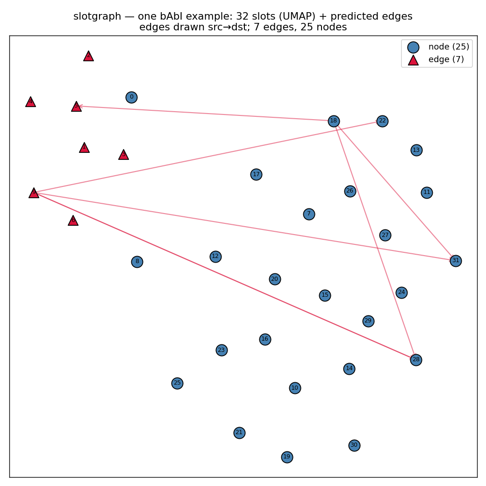
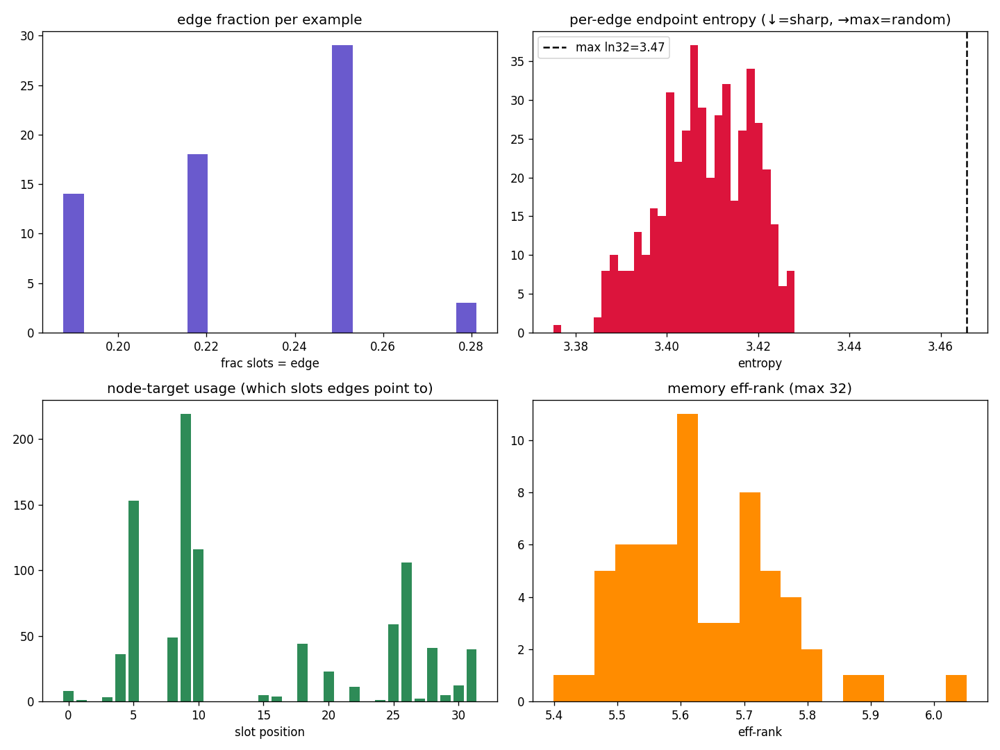

# slotgraph diagnostics — did the emergent graph form, or collapse?

**Date:** 2026-06-22 · **Model:** `slotgraph` (the current graph arm; supersedes the retired
relational-parser `graph` model) · **Backbone:** frozen SmolLM2-135M · **Objective:** mixed 4-task
(mae / babi / continuation / condrecon_bio), 1024→32 compression, 4000 steps.

## TL;DR
slotgraph is the **cohort leader on the binding task** (bAbI EM **0.352** vs icae 0.273) and ties
icae on gist — but the diagnostics show the **graph structure did not form**: the learned edges are
near-random (endpoint entropy 98% of maximum), and the structure-prediction machinery is sitting
**untrained at its random initialization** (the injection gate and the role/src/dst heads never
moved). So the babi win is **not** from learned topology — it comes from the richer (id-tagged,
role-marked) slot identities on top of the icae base. This is the **membership-only wall**, made
literal: the flat icae channel does the work and the graph machinery is bypassed.

## 1. What slotgraph is (one paragraph)
ICAE write (own frozen base + encoder-LoRA, M=32 slots appended to the passage and run through the
LM's own layers) **+** a per-LM-layer head that predicts, hard via straight-through, whether each
slot is a NODE or an EDGE and (for edges) which two slot-positions it connects. The prediction is
concretized into a TokenGT embedding `e = role + identity` (id = fixed orthonormal per-position code;
edge endpoint = transparent **sum** id[src]+id[dst]) and re-injected (gated by `inject_scale`) into
the slot positions before each layer. Read = prepend the 32 slots. `use_structure=False` = pure icae.

## 2. Cohort result (4000 steps, sorted by bAbI EM)

| model | mae ↓ | **babi EM ↑** | babi loss ↓ | cont ↓ | cont-early ↓ | condrec ↓ |
|---|---|---|---|---|---|---|
| **slotgraph** | **6.574** | **0.352** | 0.970 | 3.364 | 4.022 | 2.378 |
| icae | 6.581 | 0.273 | 0.984 | 3.363 | 4.017 | 2.353 |
| ccm | 6.610 | 0.242 | 1.032 | 3.373 | 4.040 | 2.358 |
| vqicae | 6.690 | 0.234 | 1.066 | 3.494 | 4.344 | 2.365 |
| autocompressor | 6.581 | 0.223 | 1.057 | 3.365 | 4.028 | 2.391 |
| biomem | 6.696 | 0.211 | 1.035 | 3.524 | 4.407 | 2.178 |
| graph (retired) | 6.634 | 0.203 | 1.026 | 3.418 | 4.157 | 2.370 |
| beacon | 6.587 | 0.176 | 1.116 | 3.405 | 4.109 | 2.478 |

slotgraph tops babi and mae; the question the diagnostics answer is **where that comes from**.

## 3. Structure diagnostics (`scripts/diagnostics/slotgraph_diag.py`, 64 bAbI examples)

| signal | value | reading |
|---|---|---|
| edge fraction | 0.229 (~7 edges/example) | role head is used — a real node/edge mix |
| role entropy | 0.638 / 0.693 (ln2) | role is fairly soft but does split |
| **endpoint entropy** | **3.408 / 3.466 (ln32) = 98%** | **edges are near-random** (uniform src/dst) |
| node-target usage | 21/32 slots; top-2 = 40% | spread (not hub-collapsed) — but spread *by randomness* |
| memory eff-rank | 5.64 / 32 | **healthy** — slots diverse, no rank collapse |

The slots are healthy (diverse, not collapsed — inherited from the icae base, which is why babi EM
is genuinely high). But the **edges carry no information**: their src/dst distributions sit at 98% of
maximum entropy, i.e. each edge points to an effectively uniform/random node.

### Visualizations
**One bAbI example — 32 slots in UMAP, with the predicted edges drawn (src→dst):**

The arrows do not connect any coherent cluster structure — they scatter, consistent with random edges.

**Histogram panel** (edge fraction; per-edge endpoint entropy vs the dashed `ln32` max; node-target
usage; memory eff-rank):

The decisive panel is top-right: per-edge endpoint entropy is piled **right on the maximum line**.

## 4. WHY the topology didn't form (weight inspection of the trained checkpoint)

The structure machinery is essentially **frozen at its random initialization**:

| parameter | trained value | init | moved? |
|---|---|---|---|
| `inject_scale` (= 0.5·σ(inject_raw)) | **0.1000** | 0.10 | **no** — the gate that lets structure into the LM never grew |
| `temp` (= exp(log_temp)) | **0.999** | 1.0 | no — distributions never sharpened |
| `role_head` ‖W‖ | 0.859 | ≈0.816 fresh | ~no |
| `src_head` ‖W‖ | 3.338 | ≈3.266 fresh | ~no |
| `dst_head` ‖W‖ | 3.340 | ≈3.266 fresh | ~no |
| `slot_init` (content seeds) | trained | — | **yes** (the slots *did* learn) |

So the **content/identity slots trained, but the structure heads + injection gate did not**. The
heads still output near-uniform distributions (hence the 98%-entropy random edges), and the gate
stays at 0.10 so the structure barely perturbs the LM.

**Root cause — no gradient pressure (a flat-channel bypass).** The icae base plus the trained slot
identities already minimize the loss; the structure path provides no *marginal* benefit, so the
optimizer leaves `inject_scale` and the structure heads at their init. With the gate small, the
structure barely affects the loss → near-zero backward signal to the heads → they never learn → random
edges → which confirms the gate should stay small. A self-consistent dead equilibrium. This is the
**membership-only wall** that retired the old graph model, here made literal: a free, easy flat
channel (the icae slots) is the bypass the optimizer always takes, so the structure is never forced
to carry information.

## 5. Attribution test (running)
`--slotgraph-no-structure` ablation (= pure icae with slotgraph's exact slot machinery), 4000 steps.
Prediction from §4: it should land at **≈ slotgraph's babi (~0.35)**, since the structure is inert —
confirming the gain is the slot/identity machinery + the icae base, **not** the graph.
*(Result will be appended here when the run lands.)*

## 6. Implications / next steps
The lesson is the project-wide one: **structure has to be forced, not offered.** Concretely, to make
the topology actually form one of:
- **Remove/strengthen the gate** — make the structure non-optional (no small `inject_scale`, or init
  it large) so the LM *must* process it → real backward pressure on the heads.
- **Bottleneck the slot content** — so the slots alone can't solve the task and the structure must
  carry information (no free flat channel).
- **A structure-necessary objective / harder binding task** where the icae base alone fails.

Until one of those forces information through the edges, slotgraph is "icae with richer slot ids" —
which is a real, useful gain on babi, but not the emergent graph we set out to build.

---
*Repro:* `scripts/diagnostics/slotgraph_diag.py` (structure + visuals), `debug_sweep_new_models.py`
(gradient/magnitude health), `mixed_band_gate_eval.py` (REAL/SHUF/OFF binding gate).
